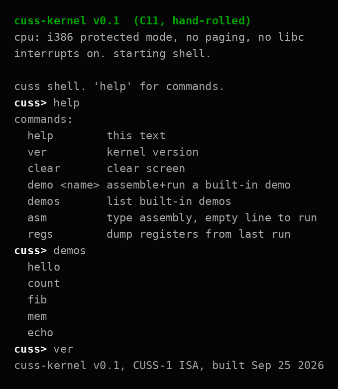
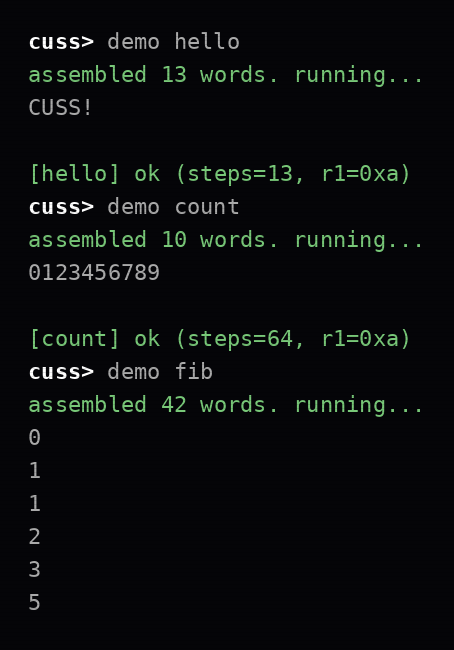
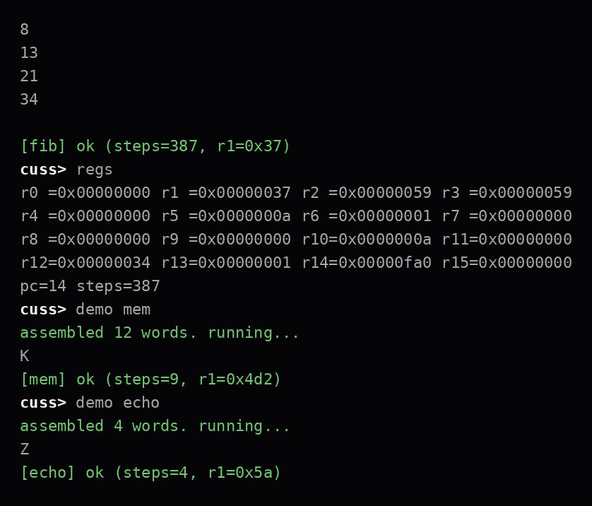

# cuss-kernel

A hand-rolled **C11 kernel** for 32-bit x86 (multiboot1) with a **custom
assembler and VM embedded in it** — plus a **Mojo** host-side reference
assembler implementing the same ISA.

The kernel boots, sets up interrupts, and drops into a shell. The shell can
**assemble CUSS-1 assembly on the bare metal** — no libc, no userspace,
no host tools involved — and execute it immediately on the in-kernel VM.
The same assembler and VM sources are compiled natively into a host test
harness, so one codebase is tested on the host and runs on the metal.

## The system operating

Screenshots below are genuine: they were produced by driving the **real**
`cuss_assemble` + `cuss_vm_run` on `programs/*.cuss` and framing the
output exactly as `kernel/shell.c` prints it (`tools/session.c`,
rendered by `docs/render.py`).

Boot, help, and the demo listing:



Running the demos — assemble on bare metal, execute on the in-kernel VM:



Register dump after `fib`, then `mem` and `echo`:



## The CUSS-1 ISA

Frozen in [ISA.md](ISA.md). The short version:

- **32-bit fixed-width words.** Three forms:

  ```
   31      24 23      20 19      16 15      12 11       0
  +-----------+-----------+-----------+-----------+
  |  opcode   |    rd     |    rs     |    rt     |  R-type
  +-----------+-----------+-----------+-----------+
  |  opcode   |    rd     |    rs     |  imm16    |  I-type (load/stor)
  +-----------+-----------+-----------+-----------+
  |  opcode   |             addr16            |  J-type
  +-----------+-------------------------------+
  ```

- **16 registers, `r0` hardwired to zero.** Reads return 0, writes are
  ignored.
- **20 instructions:** `nop hlt mov movi add sub mul div and or xor
  load stor jmp jz jnz out in call ret`.
- **4K-word data memory**, word-addressed, zero-initialised.
- **4M-step execution limit**, 256-deep return stack.
- `in`/`out` are the VM's console hooks — keyboard/VGA in the kernel,
  buffers in the host harness.
- Labels resolve to instruction-word indexes; the assembler is two-pass.

## Architecture

```
boot.S ──► multiboot1 entry, 16 KiB stack, calls kmain
kmain.c ──► serial, VGA (green-on-black banner), IDT, PIC remap,
            PS/2 keyboard, sti, then shell forever
shell.c ──► help/ver/clear/demo/demos/asm/regs
              demo:  assemble embedded .cuss ──► run on VM ──► report
              asm:   type assembly line-by-line, empty line assembles+runs
              regs:  dump r0-r15 + pc/steps from the last run
cuss/
  cuss_asm.c ──► two-pass assembler (freestanding C, no libc)
  cuss_vm.c  ──► 20-opcode interpreter (freestanding C, no libc)
```

Interrupts: 48 ISR stubs (`idt.S` → `isr_handler_c`), PIC remapped so
IRQs land on vectors 32–47, keyboard bytes go into a ring buffer.
`printf` is a tiny freestanding implementation (`%d %u %x %s %c`);
`kstring.c` provides the `memset`/`memcpy` GCC expects. The linker script
places the image at `0x100000` with separate R-X / RW- segments, and
`tools/check_mb.py` scans the ELF for the multiboot1 magic.

The key trick: `cuss_asm.c` and `cuss_vm.c` are compiled **twice** — once
with `-m32 -ffreestanding -nostdlib` into the kernel, once natively into
`tests/host/harness`. One source of truth, tested on the host, running on
bare metal.

## Layout

```
kernel/
  boot.S            multiboot1 entry, 16K stack, calls kmain
  idt.S             48 ISR stubs -> isr_handler_c
  linker.ld         linked at 0x100000, R-X / RW- segments
  kmain.c           entry: serial, VGA, IDT/PIC, keyboard, shell
  shell.c           shell: help/ver/clear/demo/demos/asm/regs
  vga.c serial.c    text-mode + COM1 drivers
  kstring.c         freestanding string/mem (+memset/memcpy for gcc)
  kstdio.c          tiny printf (%d %u %x %s %c)
  idt.c pic.c kbd.c interrupts, PIC remap, PS/2 keyboard ring buffer
  cuss/
    cuss_asm.c      two-pass CUSS-1 assembler (freestanding, shared)
    cuss_vm.c       CUSS-1 interpreter (freestanding, shared)
  include/          headers
programs/           demo .cuss programs + .expected outputs
mojo/
  cuss_asm.mojo     host-side reference assembler in Mojo
tests/host/
  harness.c         host test suite (compiles the same .c files natively)
tools/
  gen_demos.py      embeds programs/*.cuss into the kernel image
  check_mb.py       verifies the multiboot1 header in the ELF
  session.c         records an authentic shell session for docs
docs/
  session.txt       the recorded session transcript
  render.py         renders it into VGA-styled screenshots
  screenshots/      boot.png, demos.png, regs.png
```

## Build

```sh
make          # cuss-kernel.elf (32-bit multiboot kernel)
make check    # verify multiboot1 header + ELF class
make test     # host suite: assembler units, VM units, 5 demo programs
make clean
```

Requirements: `gcc` with 32-bit support, `python3`. Boot is verified
structurally (multiboot magic scan) on the build box — no QEMU there.

To boot for real: load `cuss-kernel.elf` with GRUB (multiboot1) or

```sh
qemu-system-i386 -kernel cuss-kernel.elf
```

## Shell

```
cuss> help
commands:
  help        this text
  ver         kernel version
  clear       clear screen
  demo <name> assemble+run a built-in demo
  demos       list built-in demos
  asm         type assembly, empty line to run
  regs        dump registers from last run

cuss> demo fib
assembled 42 words. running...
0
1
1
2
3
5
8
13
21
34

[fib] ok (steps=387, r1=0x37)

cuss> asm
type CUSS-1 assembly, one instruction per line.
empty line assembles and runs. 'q' alone cancels.
asm| movi r1, 72
asm| out r1
asm|
assembled 3 words. running...
H
[typed] ok (steps=3, r1=0x48)

cuss> regs
r0 =0x00000000 r1 =0x00000048 r2 =0x00000000 r3 =0x00000000
...
pc=3 steps=3
```

## Demos

`programs/` — assembled at boot into the kernel image by
`tools/gen_demos.py`, runnable from the shell with `demo <name>`:

| demo | what it does | exercises |
|------|--------------|-----------|
| `hello` | prints `CUSS!` | `movi`/`out` immediates |
| `count` | prints `0123456789` | loops with `jnz` |
| `fib` | first 10 fibonacci numbers | `call`/`ret`, dmem digit stack |
| `mem` | load/stor roundtrip, prints `K` | `load`/`stor` addressing |
| `echo` | echoes one console byte | `in`/`out`, `jz` spin |

Each has a `.expected` file; the host harness assembles the `.cuss`,
runs it on the VM, and byte-compares the output.

## Mojo reference assembler

`mojo/cuss_asm.mojo` implements the same ISA.md contract in Mojo —
readable, host-side, independent of the C code. Build with the
[Modular toolchain](https://www.modular.com/) (tested with mojo 1.1.0):

```sh
cd mojo && mojo build cuss_asm.mojo -o cuss_asm
./cuss_asm ../programs/fib.cuss
```

Verified: the Mojo binary assembles all five demo programs
**byte-identically** to the in-kernel C assembler.

## License

AGPLv3, with per-file headers on all code. See [LICENSE](LICENSE).
